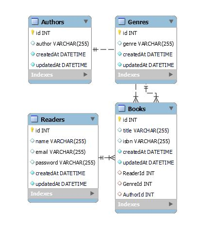

# Book Library API

## About

The Book library API project as part of the Manchester Codes Backend Module

The project implements RESTful routes and allows users to perform CRUD (Create, Read, Update, Delete) operations on authors, books, genres and readers in a MySQL database.

## Installation

- Install [Docker Desktop](https://docs.docker.com/get-docker/) if you don't already have it.
- With the Docker engine running, pull a MySQL image using the command below in your terminal:

`docker run -d -p *your port map* --name book_library_mysql -e MYSQL_ROOT_PASSWORD=*your_password*`

- Start the container in Docker Desktop (or the terminal if you prefer)
- Clone this repo
- Change in to repo directory
- Run npm install
- Create a .env file and add local variables:
  - DB_PASSWORD
  - DB_NAME
  - DB_USER
  - DB_HOST
  - DB_PORT
  - PORT
- If you wan to run the tests create a .env.test file with the same environmental variables changing the DB_NAME variable.
- Run `npm start` to start the project
- Run `npm test` to run the tests

## Routes

### Authors

- Create: POST to /authors
- Read all: GET to /authors
- Read single: GET to /authors/:authorId
- Update: PATCH to /authors/authorId
- Delete: DELETE to /authors/:authorsId

### Books

- Create: POST to /books
- Read all: GET to /books
- Read single: GET to /books/:bookId
- Update: PATCH to /books/bookId
- Delete: DELETE to /books/:bookId

### Genres

- Create: POST to /genres
- Read all: GET to /genres
- Read single: GET to /genres/:genreId
- Update: PATCH to /genres/genreId
- Delete: DELETE to /genres/:genreId

### Readers

- Create: POST to /readers
- Read all: GET to /readers
- Read single: GET to /readers/:readerId
- Update: PATCH to /readers/readerId
- Delete: DELETE to /readers/:readerId

## Author

- Will Hodgkinson
